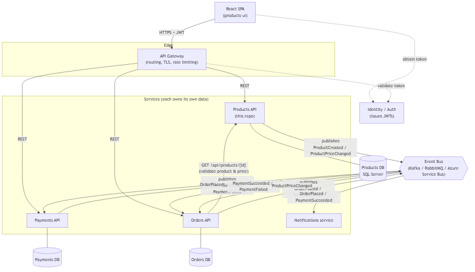
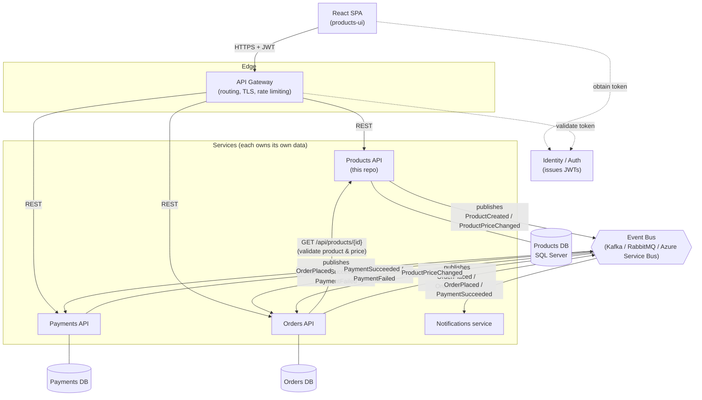

# Architecture: Products in a distributed, event-driven landscape

This repo contains a single service — **Products** — but it's designed as one participant
in a larger e-commerce system. This document shows how it would sit alongside sibling
services such as **Orders** and **Payments** in a distributed, event-driven architecture.

## Diagram





## Where Products sits, and why

**Synchronous (REST) — for reads that need an immediate, consistent answer.**
The gateway routes client reads/writes straight to Products (health check, create
product, list/filter by colour). Orders also calls Products synchronously
(`GET /api/products/{id}`) at order-placement time, when it needs the authoritative
current price — a stale cached value would be a correctness bug, not just a UX
nuisance.

**Asynchronous (events) — for propagating state across service boundaries.**
Products publishes `ProductCreated` / `ProductPriceChanged` to the event bus so that
other services (Orders' local read-model, a search/catalog index, recommendations)
can react without Products having to know who's listening or block on their
availability. Orders publishes `OrderPlaced`; Payments consumes it, attempts to
charge the customer, and publishes `PaymentSucceeded` / `PaymentFailed`, which
Orders consumes to move the order to `Paid` or `PaymentFailed`. Notifications
listens to both `OrderPlaced` and `PaymentSucceeded` to email the customer. None
of these three services call each other synchronously for this flow — a slow or
down Payments service degrades gracefully (orders queue up) instead of cascading
failures back to the client.

**Identity is centralized.** In this repo, Products issues its own demo JWTs via
`POST /api/auth/token` for self-containment. In the full system, a real Identity
Provider (Entra ID, Auth0, Keycloak, or a bespoke auth service) would issue tokens
once, and every service — including Products — would only *validate* them
(same approach as this repo's JWT bearer middleware, just pointed at an external
issuer's signing keys instead of a locally-configured key).

**Each service owns its data.** Products, Orders and Payments each have their own
database and never reach into another service's schema directly — the only ways
across a boundary are the REST calls and events shown above. This is what keeps
the services independently deployable and lets each one pick the storage engine
that fits (Products uses SQL Server here; Orders/Payments could differ).

## Regenerating the PNG

The PNG is exported from the Mermaid source above via
[mermaid-cli](https://github.com/mermaid-js/mermaid-cli):

```bash
npx -y @mermaid-js/mermaid-cli -i docs/architecture.mmd -o docs/architecture.png -b transparent
```

(`docs/architecture.mmd` holds the same diagram source as the fenced block above.)
